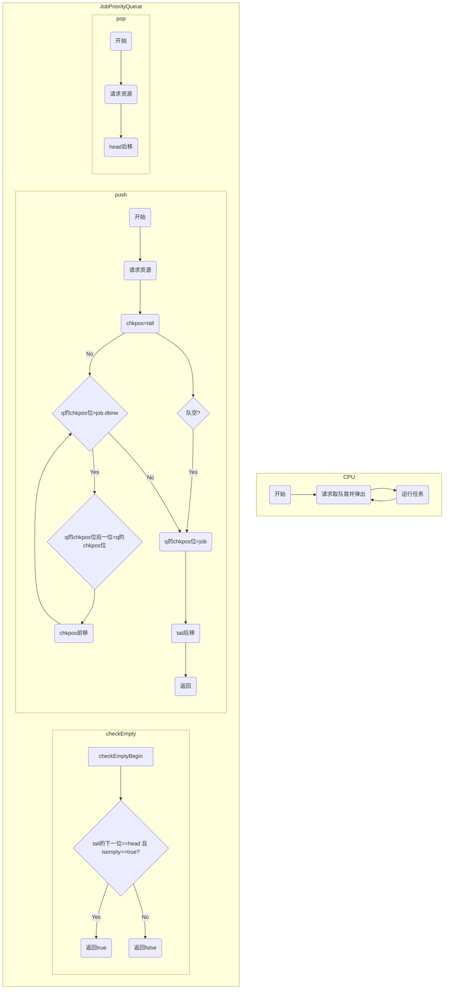

```mermaid
graph TD


subgraph CPU
end
subgraph CPU
	cpuBegin(开始)
	cpuReqFront(请求取队首并弹出)
    cpuRun(运行任务)
    cpuBegin-->cpuReqFront
    cpuReqFront-->cpuRun
    cpuRun-->cpuReqFront
end

subgraph  JobPriorityQueue

subgraph checkEmpty
    checkEmptyBegin
    checkEmptyCheck{ tail的下一位==head 且 isempty==true?}
    checkEmptyReturnTrue(返回true)
    checkEmptyReturnFalse(返回false)
    checkEmptyBegin-->checkEmptyCheck
    checkEmptyCheck-->|Yes|checkEmptyReturnTrue
    checkEmptyCheck-->|No|checkEmptyReturnFalse
end

subgraph push
	pushBegin(开始)
	pushReqResource(请求资源)
    nowchkposEqltail(chkpos=tail)
    queueEmpty{队空?}
    placeJob(q的chkpos位=job)
    posLarger{q的chkpos位>job.dtime}
    move{q的chkpos位后一位=q的chkpos位}
    chkposAdd(chkpos前移)
    tailAdd(tail后移)
    pushReturn(返回)
    pushBegin-->pushReqResource
    pushReqResource-->nowchkposEqltail
    nowchkposEqltail-->queueEmpty
    queueEmpty-->|Yes|placeJob
    nowchkposEqltail-->|No|posLarger
    posLarger-->|Yes|move
    posLarger-->|No|placeJob
    move-->chkposAdd
    chkposAdd-->posLarger
    placeJob-->tailAdd
    tailAdd-->pushReturn
end
subgraph pop
    popBegin(开始)
	popReqResource(请求资源)
    popJob(head后移)
    popBegin-->popReqResource
    popReqResource-->popJob
end
end

```

